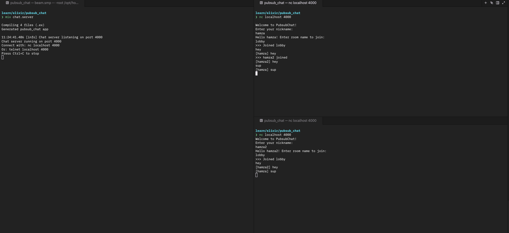

# PubsubChat

A simple pub/sub chat room system built with Elixir OTP.



## Features

- Create named chat rooms dynamically
- Join rooms with a nickname
- Broadcast messages to all users in a room
- Interactive CLI client
- Join/leave notifications

## Architecture

- **Registry** - Tracks room processes by name (`PubsubChat.Registry`)
- **DynamicSupervisor** - Manages room processes (`PubsubChat.RoomSupervisor`)
- **GenServer** - Each room is a GenServer process (`PubsubChat.Room`)
- **Client** - Interactive CLI client (`PubsubChat.Client`)

## Quick Start

Start an interactive session:

```bash
iex -S mix
```

### Interactive Client (Recommended)

```elixir
iex> PubsubChat.Client.start("lobby", "hamza")
>>> Joined lobby as hamza
> hello everyone
[hamza] hello everyone
> /help

Commands:
  /quit  - Leave the room and exit
  /help  - Show this help message

> /quit
>>> Left lobby. Goodbye!
```

To test with multiple users, open separate terminal windows:

```bash
# Terminal 1
iex --sname user1 -S mix
iex> PubsubChat.Client.start("lobby", "alice")

# Terminal 2
iex --sname user2 -S mix
iex> Node.connect(:"user1@hostname")
iex> PubsubChat.Client.start("lobby", "bob")
```

## Low-Level API

### Create a room

```elixir
{:ok, _pid} = PubsubChat.RoomManager.create_room("lobby")
```

### Join a room

```elixir
PubsubChat.Room.join("lobby", self(), "myname")
# You'll receive: {:joined, "lobby"}
```

### Send a message

```elixir
PubsubChat.Room.send_message("lobby", self(), "Hello everyone!")
# All users receive: {:new_message, "lobby", "myname", "Hello everyone!"}
```

### Leave a room

```elixir
PubsubChat.Room.leave("lobby", self())
# You'll receive: {:left, "lobby"}
# Others receive: {:user_left, "lobby", "myname"}
```

## Running Tests

```bash
mix test
```

## License

MIT
